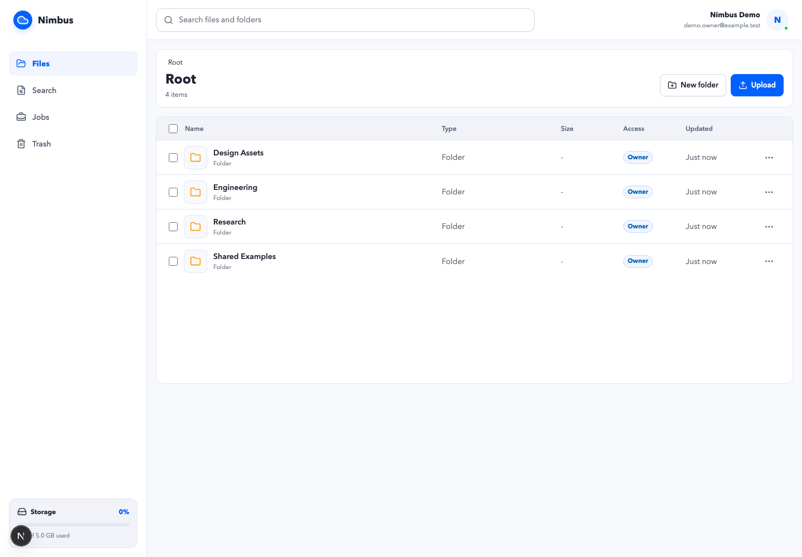
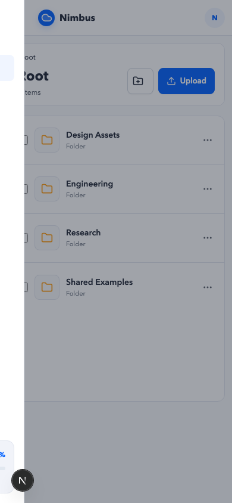
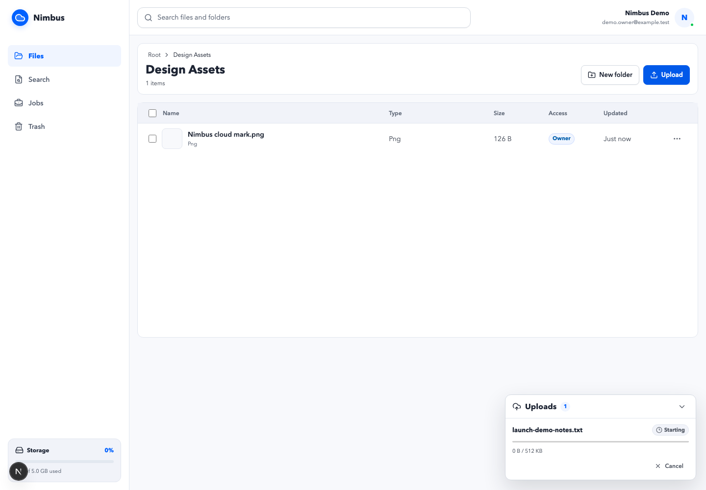
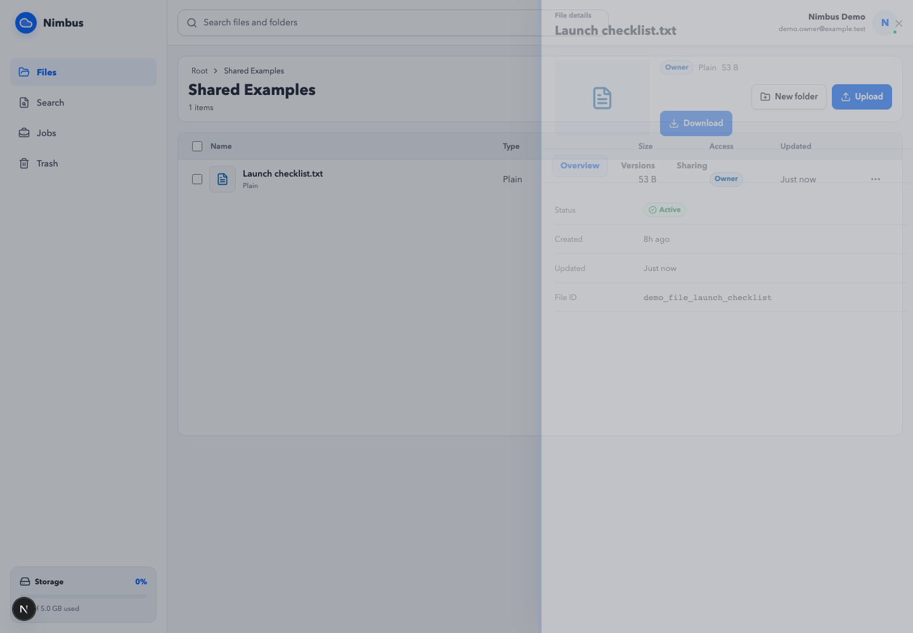
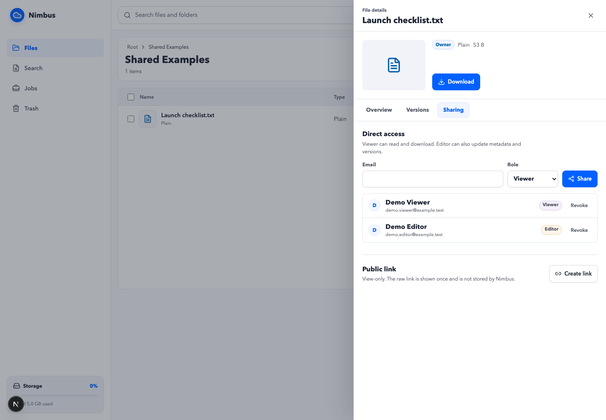
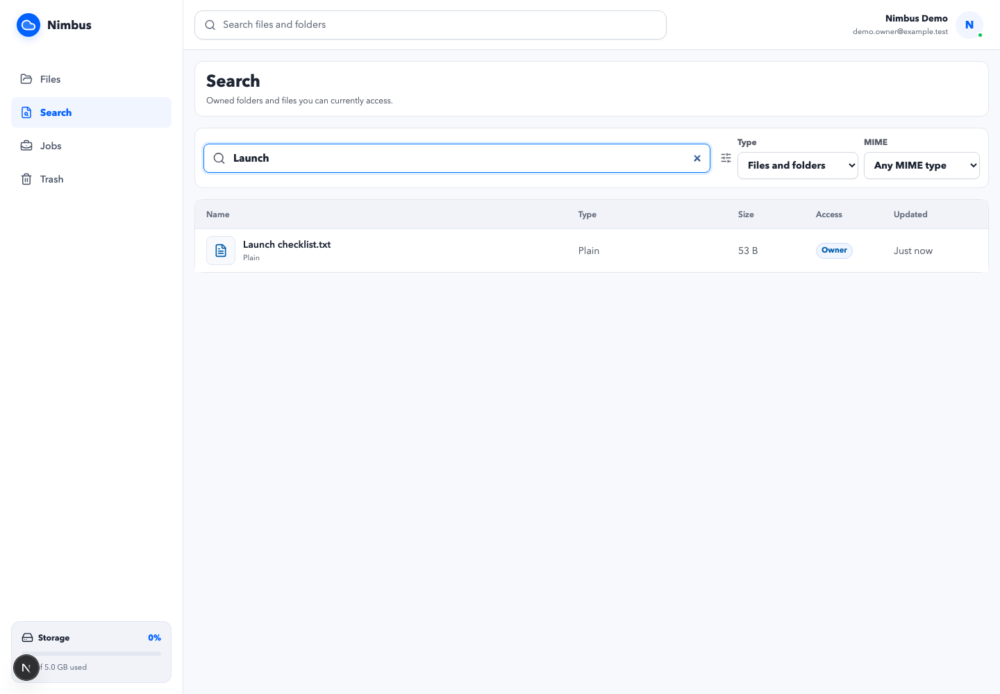
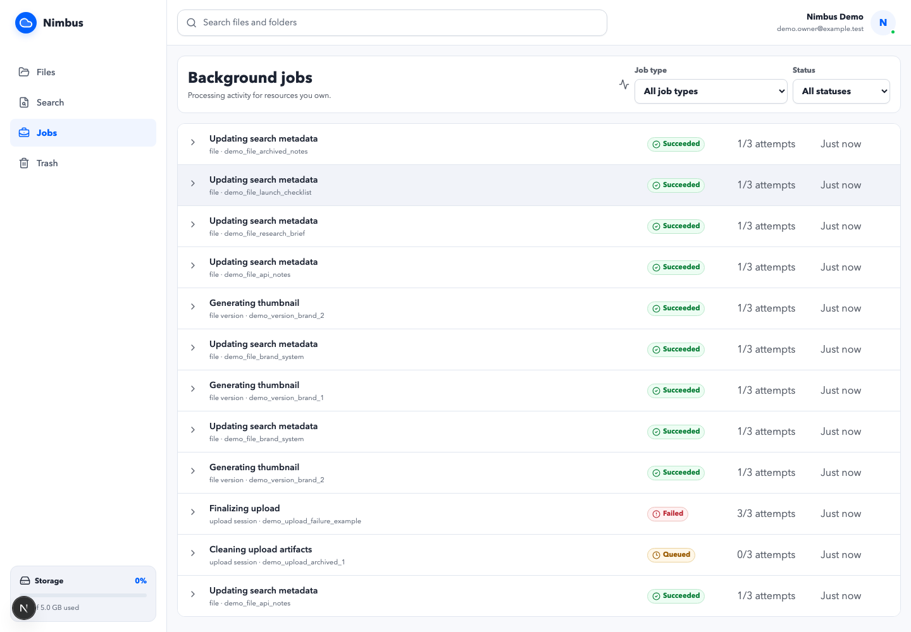
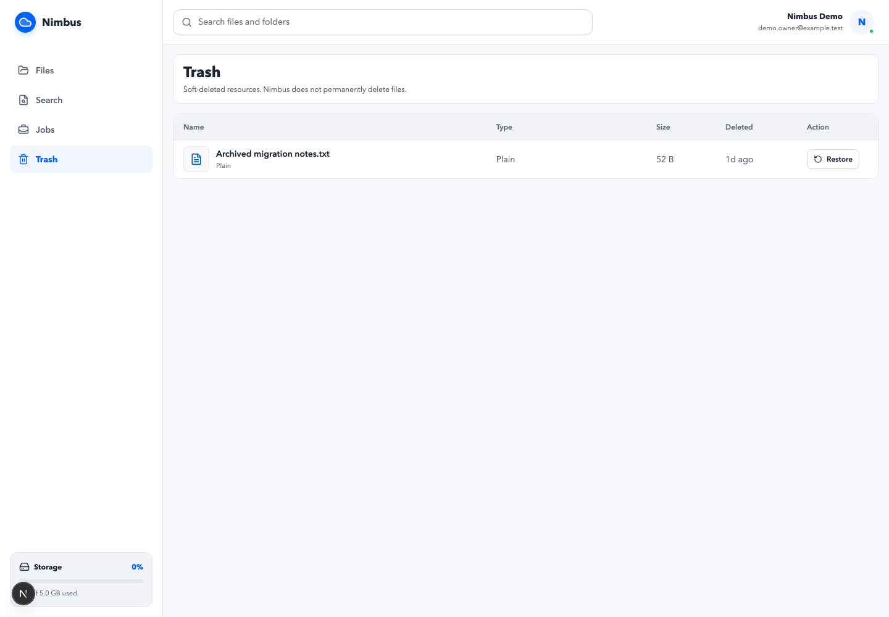
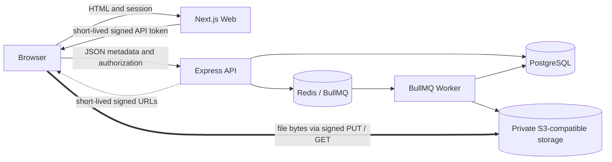

# Nimbus

Nimbus is a production-configurable cloud file workspace built to demonstrate storage-system engineering end to end. It combines direct-to-object-storage uploads, immutable versions, deny-by-default sharing, authorization-safe search, durable workers, and a responsive web console.

**Status:** Managed web/API/data/storage integration is validated at [Nimbus Web](https://nimbus-web-psi.vercel.app) and [Nimbus API](https://nimbus-api-q8bc.onrender.com). GitHub OAuth, eight migrations, managed PostgreSQL/Redis readiness, private R2 CORS, direct browser upload, and worker-driven finalization from a local worker have passed. The permanent Render worker and remaining operational gates are still pending; this is not yet a fully validated production launch.

## Product Overview

Nimbus supports single-part and resumable multipart uploads, folder organization, file versioning and restore, direct viewer/editor grants, public view-only links, PostgreSQL metadata search, thumbnails, job visibility, and trash restore. Metadata travels through the API; large file bytes do not.

## Why Nimbus Exists

Cloud storage looks simple until uploads fail halfway through, permissions change, jobs retry, or signed URLs outlive a request. Nimbus makes those boundaries explicit and testable instead of hiding them behind a mock interface.

## Screenshots



| Mobile navigation                              | Direct upload progress                              |
| ---------------------------------------------- | --------------------------------------------------- |
|  |  |
| File details                                   | Sharing and public links                            |
|   |                  |
| Search                                         | Background jobs                                     |
|               |                        |
| Trash                                          |                                                     |
|                 |                                                     |

All screenshots are generated from deterministic synthetic demo data with `pnpm screenshots:capture`.

## Key Features

- Folder create, rename, move, drag-and-drop organization, soft delete, and restore.
- Direct single-part and resumable multipart uploads with progress, retry, cancellation, and durable chunk registration.
- Immutable file versions, new-version upload, and current-version pointer restore.
- Existing-user viewer/editor shares, revocation, and 256-bit public view-only links.
- Authorization-safe PostgreSQL metadata search across owned and directly shared files.
- Private image thumbnails, owner-scoped job status, and idempotent BullMQ workers.
- Typed Zod contracts, generated OpenAPI 3.0.3, structured errors, and request correlation IDs.

## Architecture



The web tier has no database or object-storage credentials. The API authorizes and signs exact-object operations; workers finalize uploads, reconcile metadata, generate thumbnails, and clean terminal upload artifacts.

## Upload Flow

1. The browser requests an upload session from the API.
2. The API checks `file.write`, reserves metadata, and returns a short-lived exact-object signed URL or multipart part URLs.
3. The browser transfers bytes directly to private object storage.
4. Multipart part metadata is durably and idempotently registered in PostgreSQL.
5. Completion enqueues worker-driven finalization; the worker verifies storage, creates the immutable version, and updates the current pointer.

## Security Model

- Auth.js owns the secure web session. GitHub OAuth is the supported production provider.
- The web server mints a five-minute HS256 API token with fixed issuer and audience; the browser keeps it in memory only.
- The API verifies the token independently, provisions the internal user, and checks disabled status on each request.
- `PermissionService` is deny-by-default for owner, active direct-share, and scoped public-link access.
- Public tokens use 256 bits of Node crypto randomness; only SHA-256 hashes are persisted.
- Signed URLs are short-lived, exact-object scoped, and never stored in audit logs, jobs, snapshots, or application logs.
- Production rejects dev-auth headers, untrusted origins, placeholder secrets, and insecure HTTP service URLs.
- Redis-backed user/IP rate limits protect public access, search, share/upload writes, and signed URL issuance.

Already-issued signed URLs cannot be revoked immediately and remain usable until their short TTL expires.

## Tech Stack

| Layer      | Technology                                                               |
| ---------- | ------------------------------------------------------------------------ |
| Web        | Next.js App Router, React, Auth.js, Lucide                               |
| API        | Express, Zod, OpenAPI, JOSE                                              |
| Data       | PostgreSQL, Prisma                                                       |
| Queue      | Redis, BullMQ                                                            |
| Storage    | MinIO locally; Cloudflare R2/AWS S3-compatible APIs in production        |
| Processing | Sharp thumbnail worker                                                   |
| Testing    | Vitest, Supertest, Playwright Chromium/Firefox/WebKit, axe, MinIO smokes |

## Local Setup

Prerequisites: Node.js 24+, pnpm 11+, and Docker Desktop or a compatible Docker daemon.

```bash
pnpm install --frozen-lockfile
cp .env.example .env
docker compose up -d postgres redis minio
docker compose run --rm minio-init
pnpm db:generate
pnpm db:deploy
pnpm dev
```

Open `http://localhost:3000`. The API, MinIO API, and MinIO console use ports `4000`, `9000`, and `9001` respectively.

## Demo Setup

```bash
pnpm demo:reset
pnpm demo:seed
```

The seed is idempotent and creates three `example.test` users, seven folders, five files, six versions, shares, safe link records, jobs, trash, and a thumbnail. Reset deletes only those fixed demo users and their database-derived object locations. Both commands refuse production; reset additionally requires its explicit destructive guard.

## Test Commands

```bash
pnpm test
pnpm typecheck
pnpm lint
pnpm format:check
pnpm build
pnpm --filter @nimbus/web test:e2e
pnpm smoke:minio:multipart
pnpm smoke:minio:thumbnail
pnpm smoke:minio:cleanup
pnpm smoke:metadata:indexing
pnpm load:smoke
```

The cross-browser smoke covers authentication, folders, upload, file details, delete/restore, search, jobs, trash, and mobile navigation in Chromium, Firefox, and WebKit. Chromium runs the full workflow and axe checks.

## Deployment

1. Create managed PostgreSQL and Redis on Render and a private R2/S3 bucket with CORS for the web origin.
2. Deploy `apps/api/Dockerfile` and `apps/worker/Dockerfile` through `render.yaml`.
3. Set production server secrets on only the services that need them; run Prisma migrations through the API pre-deploy command.
4. Deploy `apps/web` to Vercel with Auth.js/GitHub credentials, the shared API-token secret, and public API URL. Do not provide database or storage credentials.
5. Configure exact HTTPS web/API URLs, GitHub callback URL, CORS origins, and trusted proxy handling.
6. Verify `/health`, `/ready`, sign-in, upload, download, worker completion, and revocation before directing traffic.

The repository does not contain automatic production publishing. Deployment requires explicitly configured protected platform credentials.

The live OpenAPI 3.0.3 document is available at [Nimbus OpenAPI](https://nimbus-api-q8bc.onrender.com/api/v1/openapi.json). The permanent worker definition is repository-ready but was not deployed during M10.6 preparation. See [Production Validation](docs/PRODUCTION_VALIDATION.md) for passed and blocked gates.

## API Documentation

Run the API and import `http://localhost:4000/api/v1/openapi.json` into an OpenAPI 3 viewer. The generated document covers files, folders, uploads, versions, search, jobs, shares, public access, trash, thumbnails, pagination, authentication, and stable error envelopes without internal storage fields.

## Current Limitations

- The worker is not yet permanently hosted; asynchronous features stop when the validated local production-connected worker stops.
- Full production browser/accessibility, monitoring, backup restore, rollback, secret rotation, hosted-worker restart behavior, and production screenshots remain incomplete.
- GitHub is the only configured production Auth.js provider.
- Search covers metadata, not file contents, OCR, typo tolerance, or semantic search.
- Public links are view-only and cannot be password protected.
- Delete is recoverable soft delete; permanent deletion and retention-policy UI are intentionally absent.
- Thumbnails support JPEG, PNG, and WebP rather than full document preview/conversion.
- This is a single-region, single-user-workspace architecture without organizations, billing, quotas, notifications, API keys, SDKs, or sync clients.

## Roadmap

M1-M10 are implemented. Future work is intentionally limited to separately designed milestones such as broader storage-provider validation, observability exporters, backup drills, and carefully scoped product capabilities. No deferred feature is partially scaffolded here.

## License

MIT. See [LICENSE](LICENSE).
